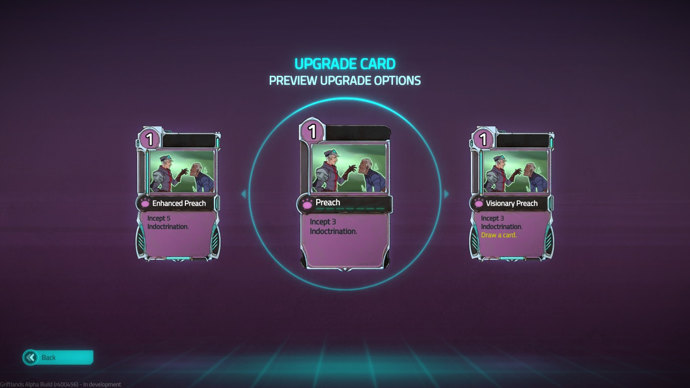
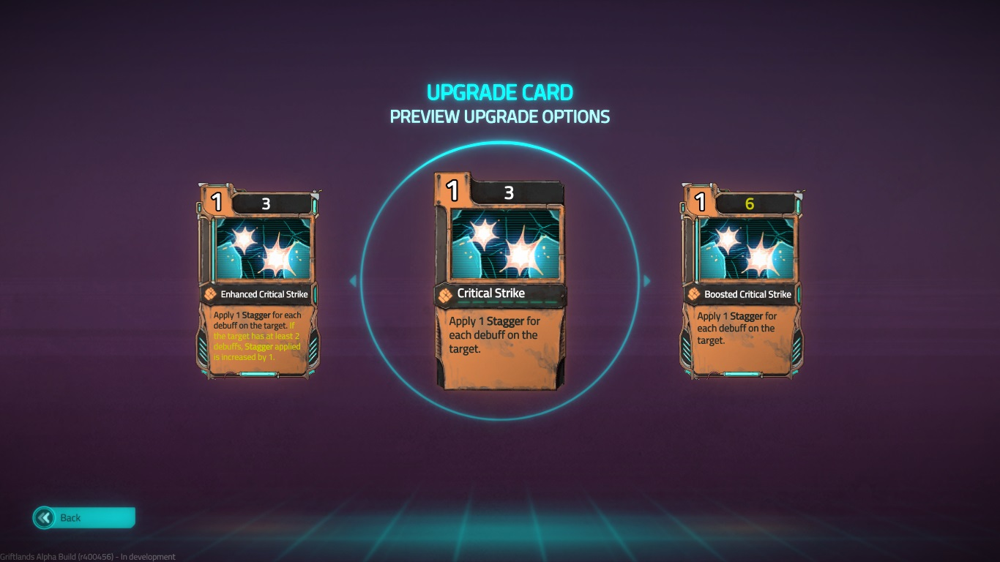

# Notes for specific cards

## Negotiation

### **Back Down**

* Removing an argument on your side does not trigger a bounty, while removing an argument on the opponent's side does. This is to avoid a situation where you accidentally removed an opponent bounty without getting the benefits.

### **Blackmail**

* For **Blackmail** and **Tall Blackmail**, because they are still hostile cards, they are still affected by **Dominance**. Similarly, because **Twisted Blackmail** is still a diplomacy card, it is still affected by **Influence**.
* This card is changed from uncommon to common due to it having to little damage output without synergy.

### **Clairvoyance**

* Each **Clairvoyance** creates a seperate modifier, so the player can make a choice for each modifier.
* Unfortunately, there is no way for the player to tell which modifier it is from when choosing between options. It might be changed later.

### **DARVO**

* The amount of damage reflected is rounded down.
* Because damage reflected is still dealt as damage, it will be affected by modifiers such as **Vulnurability**
* Originally, **Draining DARVO** is supposed to negate half of the incoming damage, but I have no idea how to change the damage when an argument is about to take damage, so now it heals instead of damage never happens. Can probably leads to broken combos like heal everything to a ridiculous amount.
* Because trample damage is a seperate instance of damage, this card will try to reflect that damage as well, resulting in more than the expected amount of total damage being reflected.
* The argument created by this card can still reflect damage immediately after it becomes destroyed, but won't reflect trample damage.

### **Fake Promise**

* **Gain Shills At The End** is a bounty which has "Gain 5 shills at the end of this negotiation for each stacks on this bounty if this bounty still exists, regardless whether you win or lose."
* You have to have at least shills equal to the cost indicated on the card in order to play this. If you don't, then this card becomes a dead card.
* Because there is no event trigger when the game ends, I have to make a workaround for when to give the player the shills. It is very inelegant, so it probably have a lot of bugs. For instance, you probably won't gain anything from the bounties if you concede a negotiation.
* Each **Gain Shills At The End** is created as a seperate instance when the card is used. This will give you many bounties, which can synergize with **Overwhelm**.

### **Preach**

* **Indoctrination** is a bounty created using **Rise Manifesto**. It has "When dismissed, gain 1 **Dominance** per stack. At the end of each turn, gain 1 **Influence** and reduce this argument by 1."
* The amount of **Indoctrination** is changed from this picture. See [CHANGELOG.md] for more details.

### **Surprise Information**

* This card can still be played even if the opponent has less **Impatience** than you can remove, but why would you ever do that? It expends, so you should probably save it to maximize effect.

## Battle

### **Ailment Storm**

* **Multi-level** means "This card can level up multiple times". I want to make it so that the more you upgrade, the more xp required to upgrade the card, but it won't work under the current upgrade system.
* A list of available upgrades are as bellow(`["CONDITION"] = value` means "Add 'Apply value number of **CONDITION** to the target' to the effect."):
  * ["WOUND"] = 2,
  * ["CRIPPLE"] = 2,
  * ["STAGGER"] = 3,
  * ["WEAK_POINT"] = 2,
  * ["EXPOSED"] = 2,
  * ["MARK"] = 3,
  * ["BLEED"] = 4,
  * ["BURN"] = 4,
  * ["SCORCHED"] = 2,
  * ["RICOCHET"] = 3,
  * ["SCANNED"] = 1,
  * ["dread"] = 2
* The card upgrades immediately after it reaches max xp in battle.
* The upgrades will be the ones that haven't appeared before.
* If somehow the player exhausts all the available upgrades, upgrades already on this card will reappear, but with half the stacks applied. This upgrade is added in addition to the original effect.
* The level counter doesn't do anything right now.

### **Bloodletting**

* To "trigger **Bleed** damage", the fighter takes damage equal to the stacks of **Bleed** on them and reduce the amount of **Bleed** by half - or whatever the decay rate of **Bleed** is at that time - rounded up. This can be affected by conditions such as **Cleaved**(which reduces the decay rate to 0%) and grafts. For the purpose of this card, **Bleed** always decays by 1, otherwise an enemy with **Bleed** and **Cleaved** will instantly die.
* To "trigger **Bleed** damage until the fighter dies or **Bleed** goes away", repeat the above process until:
  * The fighter dies
  * The amount of **Bleed** on the fighter is reduced to 0.
* If an enemy dies this way, the player of this card is the cause of the death, which will cause that enemy's friend to hate the player.
* **Maintained Bloodletting** has an additional clause that applies **Bleed** equal to half of the initial stacks(rounded down). This happens after the previous clause, which means that this **Bleed** will not contribute to the first effect.
* Additionally, effects that affect the decay rate of **Bleed** will not affect how much **Bleed** is applied by **Maintained Bloodletting**.

### **Bodyguard**

* **Protect** is a condition unused in the game. It means "Opponents must target enemies that have **Protect**. Remove one stack when damage is received. Remove **Protect** at the end of your turn.".
* The number of fighters on your team includes you, the player, and any panicking allies.
* If multiple fighters on the same team has **Protect**, the behavior is kind of weird. I think enemies will try to attack their original target first, and if they don't have **Protect**, target someone with **Protect**. This probably also applies to when somehow **Protect** is removed from a fighter.

### **Bullseye**

* **Ranged** is a card type just like **Attack**. Currently there is no way to tell between those two except through card description. Read carefully through every card to see which cards are **Ranged**. Most of Rook's cards are ranged because he uses guns, but some Sal's cards are ranged as well.
* **Bullseye** condition stacks up to 100 instead of 99 in other conditions, because math tells us the probability can go up to 100%.
* It is kind of hard to tell when there is a critical hit. I haven't figured out a way to change the damage type of a damage, so I directly changed the card flags so it has **Piercing**. It can go through **Defend**, but it won't double damage on enemy with **Metallic** because of how **Metallic** works. **Metallic** modifies card damage before resolving, but **Critical Damage** grants piercing to card after resolving, but before damage.
* If multiple **Bullseye** are played, the probability stacks. For example, playing 2 **Bullseye** will grant the player 20% chance of dealing **Critical Damage**.

### **Critical Strike**

* **Stagger** is a condition unused in the game. It means "When **Stagger** reaches 5, clear it and apply 1 **Stun**. Decrease by 1 at the end of your turn.".
* A debuff with a stack size larger than 1 counts as 1 debuff.
* Suprisingly, **Stagger** is not a debuff. I might change it, if I can find a way to change it without changing the source code.
* When the stacks of **Stagger** reaches a number above 5, it applies **Stun**, and the stacks of **Stagger** is reduced by 5.

### **Provoking Kick**

* A "sentient humanoid" is someone who looks like a human, thinks like a human, and speaks like a human. Currently, there are 5 races that qualifies this criteria: Humans, Kra'deshi, Shrokes, Jarackles, and Phickets(Yes, they exists. They are tired of everyone forgetting them exists that their sole purpose is to become assassins and kill everyone. That includes Sal on day 2.). Any other race, like Automechs, Crayotes, Vrocs, etc. are not sentient humanoids.
* If there are modded races, whether a character is a sentient humanoid is determined by the property "sentient" under race definition.
* **Vendetta** means "This character will always target the player when attacking.".
* Applying **Vendetta** to someone won't cause them to hate you, even though hated characters have this condition by default.
